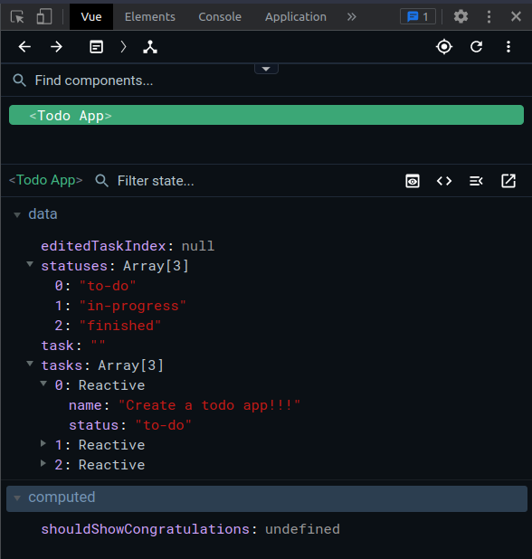

# TODO APP with Vue + Vite


Hello coders! Nowadays we have a stressful life. So to manage this and learn Vue, we are going create a TODO App. You can't call yourself developer if you haven't developed a TO-DO App.
The final result should look like this:


## Step 1: Clone the project, install it and launch it!

Fork & clone this repo, it will help you with the basic scaffolding. Using the terminal, navigate to the folder on your machine where you usually keep your repos and type this.

```
git clone https://github.com/SybilVane/todo-app-vue-vite.git

cd todo-app-vue-vite

npm install

code .

```
To launch the app and see what is already done, you can go back to the terminal (or open a new terminal inside VS code) and type this.

```
npm run dev
```
If you did everything right you will be able to see the basic template that we'll need to modify in order to make it work.


Now open the file App.vue and let's get down to business!

## Step 2: Show data on the table

The first thing we need to do in order to visualize data on our table is by using the directive `v-for`, and we can start off rendering the default data we already have in `tasks`. 
As it is an array, and we want to iterate over it and show a row for each item, let's add v-for to the `<tr>` contained in the `<tbody>`
```
<tr v-for="(task, index) in tasks" :key="index">
```
Once you do this, you will be able to replace the placeholders --- task name --- and -- task status -- with the real data.
For this remember we use the `{{  }}`.

## Step 3: Add new tasks 

Now that we have some tasks ready, we want to add new tasks to our table. For this we'll need to update the tasks array.
We will use the directive `v-model` to bind the input to the `task` contained in `data()` so that it gets updated every time you type something in it.
Next we'll need to add to the button on the side of the input the directive`@click` which will need to trigger the method `submitTask`.

This method will need to do several things:
- Check tasks are added only if task length is not 0 (no empty tasks in out list)
- Add the new task to the tasks array. By default, its status will be 'to-do', everytime we create a new task.
- Set the task back to an empty string after the new task is added (to clean up our input)

## Step 4: Delete our tasks
Next step, we'll need to delete our tasks. For that we'll need to bind the div that contains the trash icon to the method `deleteTask(index)`.
This method will need to delete the task that we want. Remember how to use `splice` ?

## Step 5: TBD Edit our tasks
...

## Extra: This is going to make your life easier

If you haven't installed Vue Developer Tools in your browser, install it immediately:

- [For Chrome](https://chrome.google.com/webstore/detail/vuejs-devtools/nhdogjmejiglipccpnnnanhbledajbpd)
- [For Firefox](https://addons.mozilla.org/en-US/firefox/addon/vue-js-devtools/)
- [For Egde](https://microsoftedge.microsoft.com/addons/detail/vuejs-devtools/olofadcdnkkjdfgjcmjaadnlehnnihnl)

Vue Developer Tools allows you check your data app from your inspector's browser without console logs and many more.

