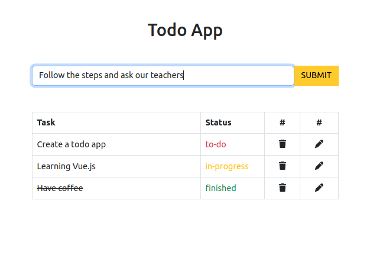

# TODO APP with Vue + Vite


Hello dears! nowadays we have s stressful life. So to manage this and learn Vue, we gonna do a TODO App. You can't call yourself developer if you didn't a TO-DO App.

## Step 1: Template

Clone this repo, it helps you to have the basic scaffoling. Write this in repo in wich you wish have it:

```
git clone https://github.com/SybilVane/todo-app-vue-vite.git

cd todo-app-vue-vite

code .
```

## Step 2: Manage entry data

If you want, at least, write the title of your task, you have to do a way to manage the entry data and store ir in our TODO App.

In this point you have to build a form. But Vue have an easier way to do this. We use v-form to link our input element in template with our state "task" in the script.

To know more about v-model, check [Form Input bindings in Vue's documentation](https://vuejs.org/guide/essentials/forms.html).

Once you have this link (easy pisy), you have to write a method to move this info from "task" to our array of "tasks". Maybe, [you'd can use an array build-in method](https://developer.mozilla.org/es/docs/Web/JavaScript/Reference/Global_Objects/Array) to do this easily.

## Step 3: Show our data

Save our task it's useless if we don't have a way to check this. An easy way to it's using v-for binding. V-for allows us render an item for each element we choose. [More info here](https://vuejs.org/api/built-in-directives.html#v-for).

```
<tr v-for="(task, index) in tasks" :key="index">
```

Try to do this with our list of tasks.

## Step 4: Edid and delete our tasks

Life is change. And our task gonna do so. It's useful use index of selected item to access to this properties out of the template.



Don't forget use different method to do this!

## Extra: This gonna make your life easier

If you haven't installed Vue Developer Tools in your browser, install it inmediately:

- [For Chrome](https://chrome.google.com/webstore/detail/vuejs-devtools/nhdogjmejiglipccpnnnanhbledajbpd)
- [For Firefox](https://addons.mozilla.org/en-US/firefox/addon/vue-js-devtools/)
- [For Egde](https://microsoftedge.microsoft.com/addons/detail/vuejs-devtools/olofadcdnkkjdfgjcmjaadnlehnnihnl)

Vue Developer Tools allows you check your data app from your inspector's browser without console logs and many more.

